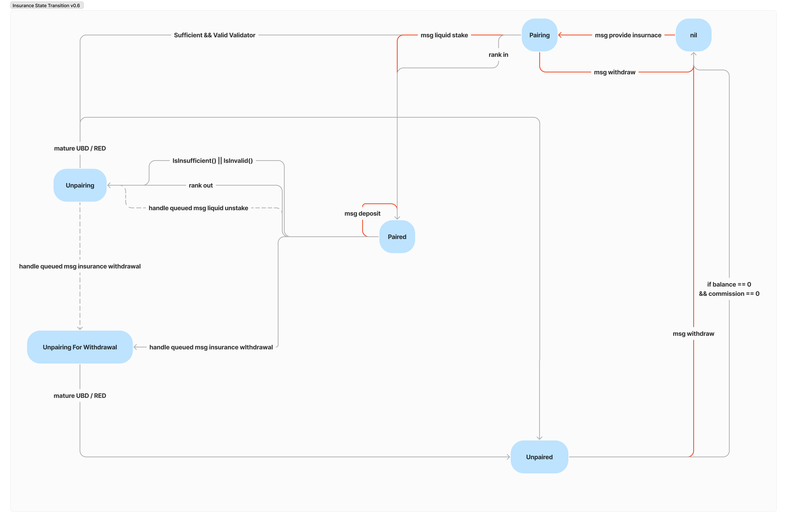

<!-- order: 3 -->

# State Transition

State transitions in chunks and insurances occur at EndBlocker when Epoch is reached.

## Diagrams

### Chunk State Transition Diagram

### Insurance State Transition Diagram

## Chunk
### nil → Paired

**Triggering Condition**

- Upon receipt of a valid `MsgLiquidStake` message if an empty chunk slot and a pairing insurance is available. Otherwise `MsgLiquidStake` fails.

**Operations**

- calc how much chunks can be created with given msg.Amount
- create multiple paired chunks, if possible.
  - get cheapest pairing insurance
  - send chunk size native tokens to `Chunk`
  - `Chunk` delegate tokens to validator of paired insurance
  - mint ls tokens and send minted ls tokens to msg.Delegator (=liquid staker)
  - state transition of `Insurance` (`Pairiing → Paired`)
  - state transition of `Chunk` (`nil → Paired`)

### Paired → UnpairingForUnstaking

**Triggering Condition**

- EndBlock & Epoch **AND**
- `UnpairingForUnstakingChunkInfo` must exists

**Operations**

- with `UnpairingForUnstakingChunkInfo` which created when delegator request liquid unstake
  - get a related `Chunk`
  - undelegate a `Chunk`
  - state transition of `Insurance` (`Paired → Unpairing`)
  - state transition of `Chunk` (`Paired → UnpairingForUnstaking`)

### Paired → Unpairing

**Triggering Condition**

- EndBlock & Epoch **AND**
- **(**
  - When paired `Insurance` start to be withdrawn **OR**
  - When paired Insurance have inSufficient (balance of insurance < minimum coverage defined in module) **OR**
  - When validator of paired insurance become tombstoned
- **)**

**Operations**

- state transition of paired `Insurance` (`Paired → Unpairing|UnpairingForWtihdrawal`)
- state transition of `Chunk` (`Paired → UnpairingForUnstaking`)

### UnpairingForUnstaking → nil

**Triggering Condition**

- EndBlock & Epoch

**Operations**

- finish unbonding
  - burn escrowed ls tokens
  - send chunk size tokens back to liquid unstaker
- state transition of `Insurance` (`Unpairing → Unpaired`)
- delete `UnpairingForUnstakingChunkInfo`
- delete `Chunk` (`UnpairingForUnstaking → nil`)

### Unpairing → Pairing

**Triggering Condition**

- EndBlock & Epoch
- When there are no candidate insurances to pair **AND**
- Chunk is not damaged

**Operations**

- state transition of `Insurance` (`Unpairing | UnpairingForWithdrawal → Unpaired`)
- state transition of `Chunk` (`Unpairing → Pairing`)

### Unpairing → nil

**Triggering Condition**

- EndBlock & Epoch
- The chunk got damaged, which meant that the insurance couldn't fully cover the penalty.

**Operations**

- send all balances of `Chunk` to reward module
- state transition of `Insurance` (`Unpairing | UnpairingForWithdrawal → Unpaired`)
- delete `Chunk` (`Unpairing → nil`)

## Insurance

### nil → Pairing

**Triggering Condition**

- Upon receipt of a valid `MsgProvideInsurance` message if an empty chunk slot and a pairing insurance is available. Otherwise `MsgProvideInsurance` fails.

**Operations**

- escrow insurance tokens from provider
- create pairing `Insurance`

### Pairing → Paired

**Triggering Condition**

- EndBlock & Epoch **OR**
- If there are an empty slot and got MsgLiquidStake

**Operations**

- state transition of `Insurance` (`Pairiing → Paired`)
- state transition of `Chunk` (`nil → Paired`)

### Paired → UnpairingForWithdrawal

**Triggering Condition**

- EndBlock & Epoch **AND**
- If there are an `WithdrawInsuranceRequest`

**Operations**

- consume **`WithdrawInsuranceRequest`**
  - state transition of `Insurance` (`Paired → UnpairingForWithdrawal`)
  - state transition of `Chunk` (`Paired → Unpairing`)
  - delete `WithdrawInsuranceRequest`

### Paired → Unpairing

**Triggering Condition**

- EndBlock & Epoch **AND**
- **(**
  - paired `Chunk` is started to undelegate **OR**
  - When paired Insurance have inSufficient (balance of insurance < minimum coverage defined in module) **OR**
  - When validator of paired insurance become tombstoned
- **)**

**Operations**

- state transition of `Insurance` (`Paired → Unpairing`)
- state transition of paired **`Chunk`** (`Paired → Unpairing`)

### UnpairingForWithdrawal → Unpaired

**Triggering Condition**

- EndBlock & Epoch

**Operations**

- state transition of `Insurance` (`Paired → UnpairingForWithdrawal`)

### UnpairingForWithdrawal | Unpairing → nil

**Triggering Condition**

- EndBlock & Epoch **AND**
- Unpairing chunk got damaged(meaning insurance already send all of its balance to chunk, but was not enough) and there are no balances of insurance fee pool

**Operations**

- state transition of `Insurance` (`UnpairingForWithdrawal | Unpairing → nil`)
 
### Unpaired → nil

**Triggering Condition**

- Upon receipt of a valid `MsgWithdrawInsurance` message for unpaired `Insurance`

**Operations**

- send all balances of Insurance to provider
- send all commissions of Insurance fee pool to provider
- delete insurance (`Unpaired → nil`)