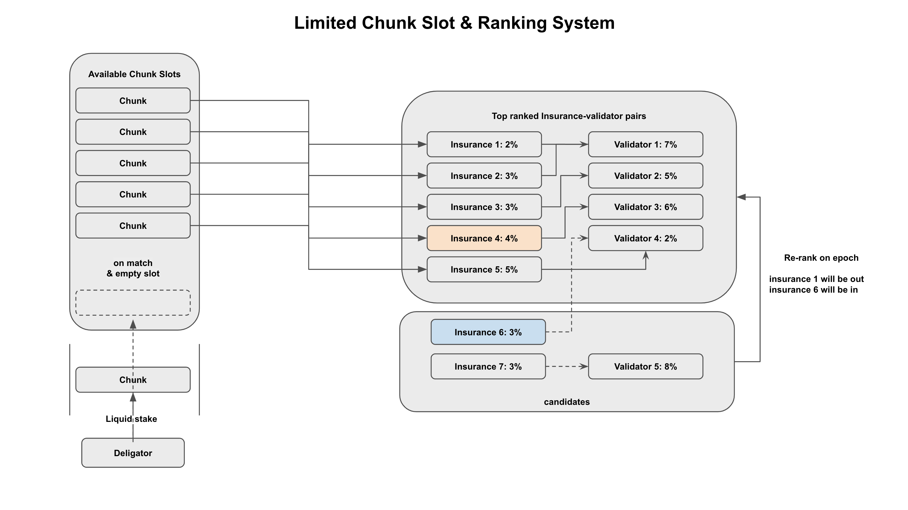
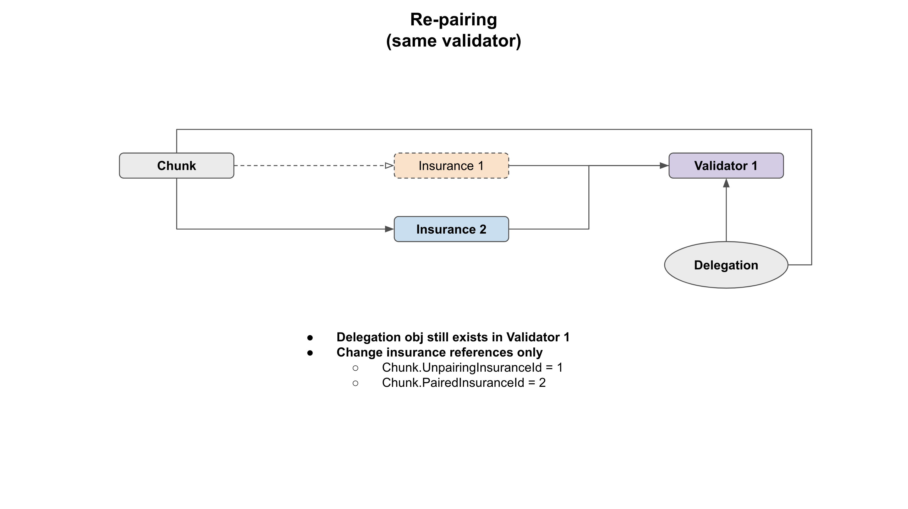
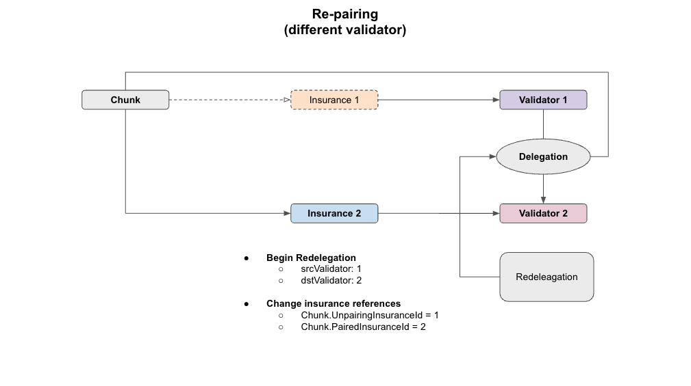
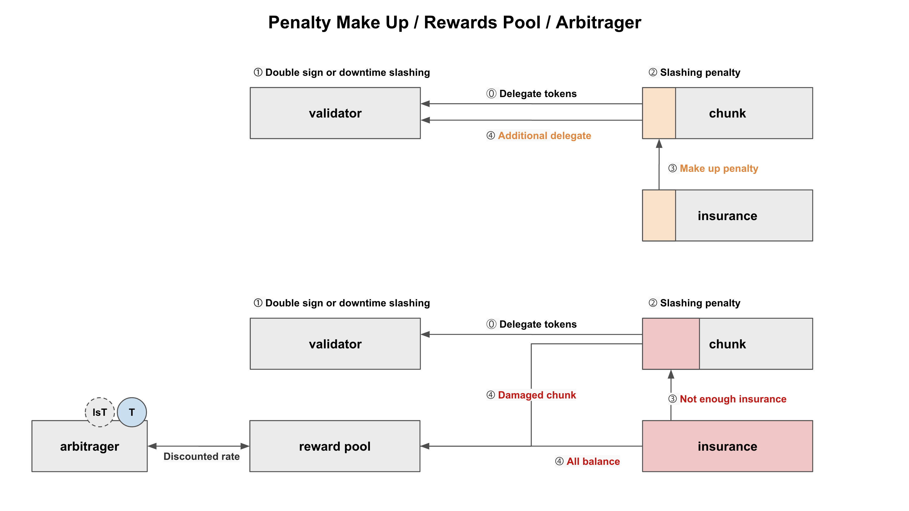
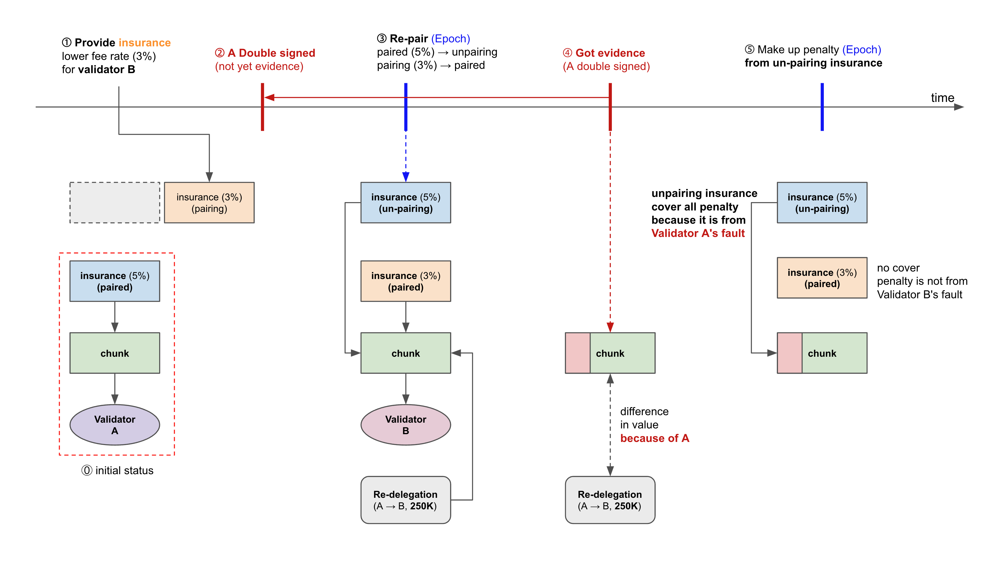

<!-- order: 5 -->

# ABCI

This document describes the prerequisites needed to understand the BeginBlocker and EndBlocker logic of the liquidstaking module.

## Insurance Ranking

Each insurance-validator pair is ranked at epoch. The ranking is calculated based on the sum of the validator's commission rate and the insurance's fee rate. 

The above figure is a diagram illustrating the insurance-validator pairs' ranking calcualtion and re-pairing of chunks process in the liquid staking module.
Five insurances have been allocated to the available chunk slot (`max chunk slot = 5`), each with the following insurance fees and the ranking (Ranking is determined in ascending order of insurance fees and validator commission rates).
In case of the same ranking, the ranking is assigned in a "first come, first served" manner (e.g., insurance 2 and 4).

| id   | fee rate | validator commission rate | total | ranking |
|------|----------|---------------------------|-------|---------|
| 1    | 2%       | 7%                        | 9%    | 3       |
| 2    | 3%       | 7%                        | 10%   | 4       |
| 3    | 3%       | 5%                        | 8%    | 2       |
| 4    | 4%       | 6%                        | 10%   | 5       |
| 5    | 5%       | 2%                        | 7%    | 1       |

When a chunk is liquid staked, pairing is done sequentially starting from the insurance with the highest ranking. Therefore, in the above diagram, the 3 chunks that are staked will be paired with insurance 5, 3, 1, 2 and 4 in that order.

Before reaching the next epoch, a new insurance, Insurance 6, has been added, which refers to Validator 4. The total fee for this insurance-validator pair is 5%, making it more attractive in terms of fees compared to the existing insurance-validator pairs.
Therefore, in the next epoch, this insurance-validator pair will occupy the top position in the ranking, and since the max chunk slot is 5, the insurance with the lowest ranking, Insurance 4, will be pushed out of the slot.
In other words, the chunks paired with Insurance 4 (rank-out) are re-paired with Insurance 6 (rank-in).

## Re-pairing
The re-pairing process depends on whether the rank-in insurance points to the same validator as the rank-out insurance or not.

**Case 1**: Rank-in insurance points to the same validator as the rank-out insurance

In this case, where both the rank-in and rank-out insurances indicate the same validator, the re-pairing process is relatively straightforward. Since the validator remains the same, there is no need to modify the chunk's delegation. The only change required is to update the insurance reference for the chunk, ensuring that it correctly reflects the rank-in insurance. This process ensures that the chunk's delegation continues to be properly insured by the same validator, and it can be accomplished by updating the insurance reference without additional delegation changes.

**Case 2**: Rank-in insurance points to a different validator than the rank-out insurance

In this case, a more complex re-pairing process is necessary as the chunk's delegation needs to be realigned with the change in the insured validator. This entails re-delegating the chunk's stake from the validator specified by the rank-out insurance to the new validator indicated by the rank-in insurance. This adjustment ensures that the chunk's stake is appropriately insured by the rank-in insurance and maintains the security and integrity of the liquid staking module.
Since the re-delegation period is the same as the epoch duration, the re-delegation process will be completed during the next epoch. This ensures a smooth transition with the chunk's delegation effectively moved to the new validator specified by the rank-in insurance at the beginning of the next epoch.

## Slashing Penalty Covering

### Basics

When a validator is slashed, the chunk's delegation may be lost due to downtime or double signing. This is the reason insurance exists. Insurance is designed to cover such losses.

The figure above illustrates a scenario where a chunk's delegation is lost due to a validator's double signing. 
When insurance covers the loss, there are two cases depending on the size of the loss.

**Case 1:** When insurance can cover the loss completely (penalty <= insurance balance, colored in orange)

In this scenario, insurance sends the full penalty amount of coins to the chunk, and the chunk subsequently delegates those coins to the validator.
The chunk's delegation is restored to its original size, and the chunk's delegation shares are updated accordingly.

**Case 2:** When insurance cannot cover the loss completely (penalty > insurance balance, colored in red)

In this situation, the chunk's value is less than the required chunk size even if insurance covers the loss with all of its balance. In this case, insurance sends all of its balance to the reward pool, and the chunk's delegation is un-delegated. The un-delegated tokens from the chunk are sent to the reward pool at the next epoch.

Arbitragers will purchase those tokens from the reward pool using lsCanto. Rather than leaving the chunk as unusable, making it usable with lsCanto adds more value to it.

### Advanced

A chunk can indeed have both paired insurance and unpairing insurance simultaneously. 
This situation arises during re-pairing when an insurance with a high fee rate, initially paired with the chunk for a limited chunk slot, is replaced with a lower fee rate insurance.

If the cause of the loss occurred before the epoch, then the responsibility for covering the loss lies with the unpairing insurance. 
However, if the cause of the loss occurred after the epoch, then the paired insurance takes responsibility for covering the loss. 
This division of responsibility ensures that the appropriate insurance is used depending on when the loss occurred in relation to the epoch.

In this section, we will describe a scenario in which the unpairing insurance is required to cover the loss.

The above diagram illustrates the re-pairing (re-delegation) process and penalty cover in chronological order. 

0. Initially, The blue insurance initially covered the chunk. As the blue insurance is associated with validator A, the current delegation of the chunk is directed to validator A.
1. An orange insurance with a lower fee rate (3%) than the blue insurance (5%) was offered. However, as all chunk slots are already occupied, and the epoch transition has not occurred yet, the orange insurance remains in a pairing state without being applied.
2. Validator A double signs, but as of now, no evidence has been submitted, and therefore, no penalty has been imposed.
3. The epoch has been reached, and the orange insurance is paired with the chunk, while the original blue insurance transitions into an unpairing insurance.
4. Evidence of a double sign by Validator A is submitted and accepted. During this process, the delegation shares of the chunk that were originally with Validator B become affected, resulting in the chunk's delegation shares differing from the `sharesDst` in the `ReDelegation` object. This indicates a decrease in the delegation shares due to the penalty imposed on Validator A.
5. In the upcoming epoch, the unpairing insurance will be responsible for covering the loss incurred due to the penalty imposed on Validator A.

The cause of the slashing occurred **before the epoch (re-pairing)**, so the unpairing insurance (blue one) is responsible for covering the loss because that loss is not related to the paired insurance (orange one). This rule applies even in cases where the paired insurance and the unpairing insurance point to the same validator.

### The distinction between BeginBlock and EndBlock

Re-delegation can occur when there was re-pairing in the previous epoch, and insurances have changed, pointing to different validators. To accurately track responsibility for losses during the re-delegation period, we require the `Redelegation` object to be stored in the `staking` module.

However, the `Redelegation` object is deleted at the `BeginBlock` of the `staking` module when the re-delegation period is over. Additionally, the `staking` module's `BeginBlock` is executed before the `liquidstaking` module's `BeginBlock`.

Therefore, if we rely solely on the `EndBlock`, we cannot precisely track responsibility because the `Redelegation` object has been deleted.
